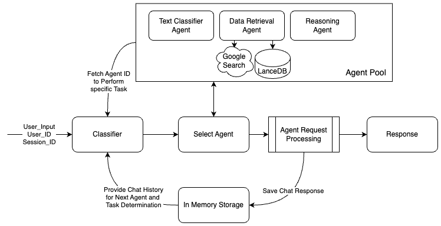

# Multi Agent Orchestator
Implementation of an orchestrator that coordinates multiple specialized AI agents to solve complex tasks. The orchestrator  determines which agent to use for each subtask, manages the flow of information between agents, and integrate their outputs into a cohesive solution.

There are three agents in the system
- A text classification agent
- A data retrieval agent
- A reasoning agent

Setting use_google_tool=False configuration for data retrieval agent will create knowledge base from local json dataset inside "retrievers" folder and store it in lanceDB vector db. This setup is timeconsuming. Hence, by default configuration is use_google_tool=True

## Architecture Diagram



## Datasets used
- HotPotQA - https://hotpotqa.github.io/
- GSM8K - https://github.com/openai/grade-school-math

## Guardrails AI Setup

1. Sing in to [Guardrails AI](https://hub.guardrailsai.com/) and generate API Key (it's free)

2. Configure:
```
guardrails configure
```

3. Download dependencies
```
guardrails hub install hub://guardrails/profanity_free
guardrails hub install hub://guardrails/detect_jailbreak
guardrails hub install hub://guardrails/detect_pii
```

## Setup

1. Clone this repository:
```
git clone https://github.com/sachi097/multi-agent-orchestator.git
```

2. Activate virtual environment and install dependencies (assuming you are in directory multi-agent-orchestator):
```
python -m venv venv
source venv/bin/activate
pip install -r requirements.txt
```
>Above steps are for Mac OS, for windows and linux please look online for instructions to activate virtual environment and install dependencies

3. Add .env file:
```
CLASSIFIER_MODEL=gpt-4o-mini
CLASSIFIER_API_KEY=openai-api-key-here

TEXT_CLASSIFIER_MODEL=gpt-4o-mini
TEXT_CLASSIFIER_API_KEY=openai-api-key-here

REASONING_MODEL=gpt-4o-mini
REASONING_API_KEY=openai-api-key-here

DATA_RETRIEVER_MODEL=gpt-4o-mini
DATA_RETRIEVER_API_KEY=openai-api-key-here
```

4. Run tests
```
python tests.py
```
>PS: Please wait initially for dataset to be downloaded

## Playground with Streamlit and Fast API

5. Launch fast api server
```
python -m uvicorn fastapi_server:app --port 8080
```

6. Launch Streamlit UI server:
```
streamlit run ui.py
```

## Testing

- File named log.txt is generated which contains results of main.py script execution, you can look for Evaluation metric in the file.
- Also, on running main.py script, logs and results of the multi-agent-orchestrator can be observed in the console

## Sample Results

1. Log.txt
```
------- Start of Evaluation Metric for Request : test-user-1-1234568 --------------------------
                        User input: Classify below Sentence whether it is Positive or Negative. Answer Positive or Negative 
Sentence: I am feeling so good today.
                        Agent response: ['Positive']
                        Number of expected agent calls: 1
                        Number of actual agent calls: 1
                        Efficiency of agent calls: 100.0 %
                        Agents expected to be called: ['Text Classification Agent']
                        Agents actually called: ['Text Classification Agent']
                        Expected result set: ['Positive']
                        Actual result set: ['Positive']
                        Total output tokens: 2
                        ----------------------------- End of Evaluation Metric for Request : test-user-1-1234568 --------------------------

                
                        ----------------------------- Start of Evaluation Metric for Request : test-user-1-123456703 --------------------------
                        User input: Evaluate A carnival snack booth made $50 selling popcorn each day. It made three times as much selling cotton candy. For a 5-day activity, the booth has to pay $30 rent and $75 for the cost of the ingredients. How much did the booth earn for 5 days after paying the rent and the cost of ingredients?
                        Agent response: ["To evaluate how much the booth earned over 5 days after paying for rent and the cost of ingredients, let's break down the information step by step.\n\n1. **Daily Income from Popcorn:**\n   - The booth makes $50 selling popcorn each day.\n\n2. **Daily Income from Cotton Candy:**\n   - It makes three times as much from cotton candy. Therefore:\n     \\[\n     \\text{Daily income from cotton candy} = 3 \\times 50 = 150 \\text{ dollars}\n     \\]\n\n3. **Total Daily Income:**\n   - The combined daily income from both snacks is:\n     \\[\n     \\text{Daily total income} = 50 + 150 = 200 \\text{ dollars}\n     \\]\n\n4. **Total Income over 5 Days:**\n   - Over 5 days, the total income generated would be:\n     \\[\n     \\text{Total income over 5 days} = 200 \\times 5 = 1000 \\text{ dollars}\n     \\]\n\n5. **Costs:**\n   - Rent for the booth is $30.\n   - The total cost for the ingredients is $75.\n   - Therefore, the total costs are:\n     \\[\n     \\text{Total costs} = 30 + 75 = 105 \\text{ dollars}\n     \\]\n\n6. **Net Earnings:**\n   - To find the net earnings after paying the costs, subtract the total costs from the total income:\n     \\[\n     \\text{Net earnings} = 1000 - 105 = 895 \\text{ dollars}\n     \\]\n\nThus, after paying the rent and the cost of ingredients, the booth earned **$895** over the 5-day activity."]
                        Number of expected agent calls: 1
                        Number of actual agent calls: 1
                        Efficiency of agent calls: 100.0 %
                        Agents expected to be called: ['Reasoning Agent']
                        Agents actually called: ['Reasoning Agent']
                        Expected result set: ['895']
                        Actual result set: ['895']
                        Total output tokens: 359
                        ----------------------------- End of Evaluation Metric for Request : test-user-1-123456703 --------------------------
```

2. Terminal output


3. Streamlit UI

